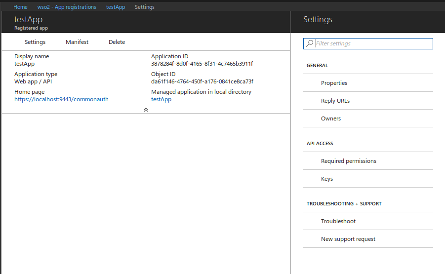
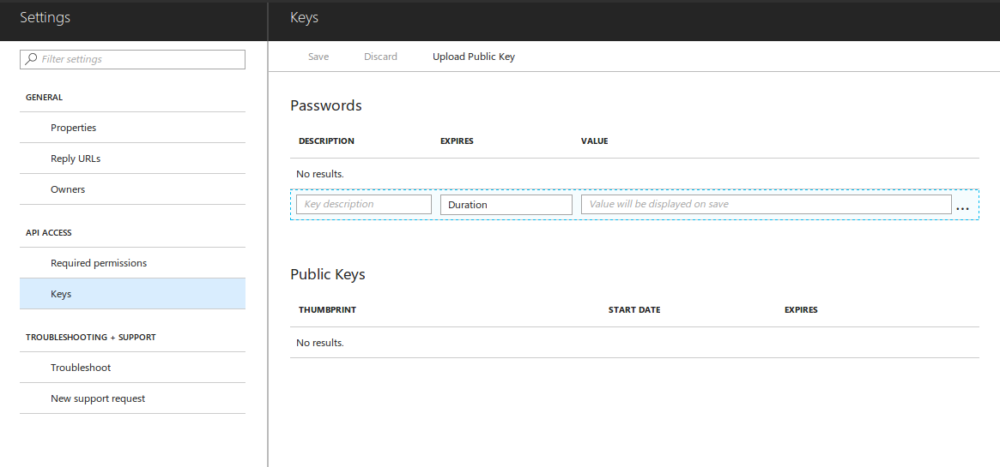
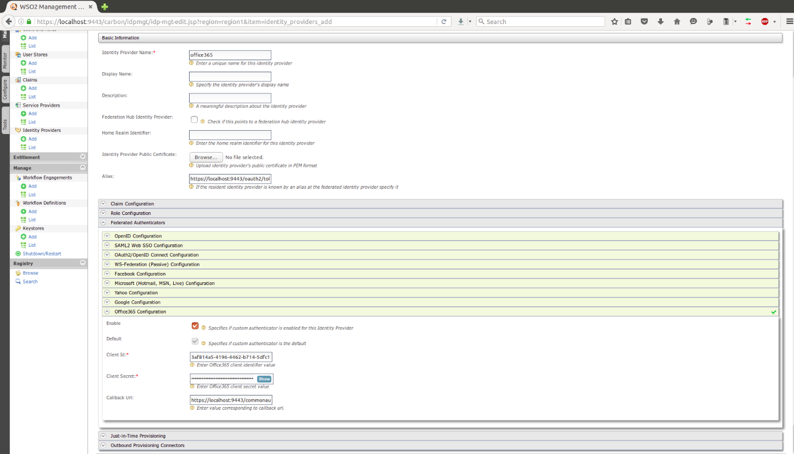
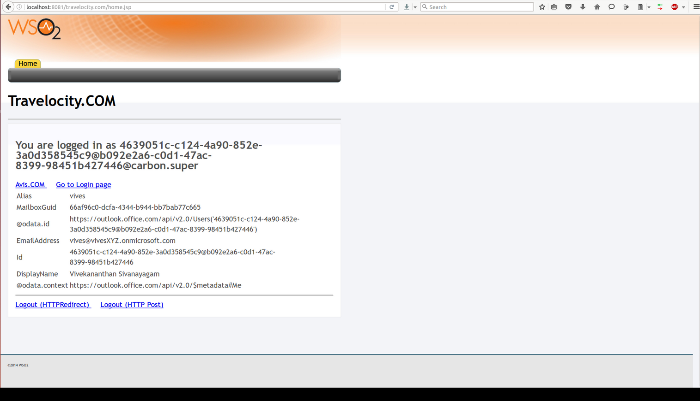

# Configuring Microsoft Azure AD Authenticator

This page provides instructions on how to configure the Microsoft Azure AD authenticator and Identity Server using a sample app. This authenticator is based on OpenID Connect. Follow the instructions in the sections given below to configure this authenticator.
 ````
This is tested for the Office365 API version 2.0.
 ````
 
* [Deploying Office365 Artifacts](#deploying-office365-artifacts)
* [Configuring the  Office365 App](#configuring-the-office365-app)
* [Deploying travelocity.com Sample App](#deploying-travelocitycom-sample-app)
* [Configuring the identity provider](#configuring-the-identity-provider)
* [Configuring the service provider](#configuring-the-service-provider)
* [Testing the sample](#testing-the-sample)

### Deploying Office365 Artifacts
 * Place the org.wso2.carbon.extension.identity.authenticator.office365.connector-1.0.3.jar file into the <IS_HOME>/repository/components/dropins directory.You can obtain this from the [WSO2 store](https://store.wso2.com/store/assets/isconnector/list?q=%22_default%22%3A%22office365%22).

 >> NOTE :If you want to upgrade the Microsoft Azure AD Authenticator (.jar) in your existing IS pack, please refer [upgrade instructions](https://docs.wso2.com/display/ISCONNECTORS/Upgrading+an+Authenticator).

### Configuring the Office365 App
 1. Navigate to [https://products.office.com/en-us/business/compare-office-365-for-business-plans](https://products.office.com/en-us/business/compare-office-365-for-business-plans) to create an account for Office365.
     
 2. Associate an Azure subscription with Office 365 account (Azure AD).

    a. If you have an existing Microsoft Azure subscription, then log on to the [Microsoft Azure Management portal](https://login.microsoftonline.com/common/oauth2/authorize?resource=https%3a%2f%2fmanagement.core.windows.net%2f&response_mode=form_post&response_type=code+id_token&scope=user_impersonation+openid&state=OpenIdConnect.AuthenticationProperties%3dKacUNidcHXlixnHEGpOm3zw3NCnurAxht3Y2rZa3Bg-LzJg6eC0mvtU3gTxOY4MzmZSX3nKUDRyk8LT6L86JUJfp038_1tlBTF-J0cL_yeo_ZOk0cgTfVKvxrL66-laSnHw4R_YXA0VaGe1HmHvvJ5blPCYwoY7xuoZWmn3bMTgMVOc4nxH-50KaxHyNFuypnUcDE-VIdKrS2niFDWDLaSPIbMM&nonce=636565268366247669.NTg2YWFmYjQtZTM2YS00NjcxLWIwNjAtNTUwMDRhNzU2NWNhYjUxZjBlNjEtN2RjYy00ODkyLWJlMzEtNWIxYTMyZjg0Njcy&client_id=c44b4083-3bb0-49c1-b47d-974e53cbdf3c&redirect_uri=https%3a%2f%2fportal.azure.com%2fsignin%2findex%2f&site_id=501430&client-request-id=c2349dd4-89d5-4c01-aa99-c91cb4d44c75&x-client-SKU=ID_NET&x-client-ver=1.0.40306.1554) with your existing office365 credentials and able to see the Dashboard of the Microsoft Azure.

    b. Alternatively, you will need to create a new Azure subscription and associate it with your Office 365 account in order to register and manage apps.
       * Sign up at [Azure.com](https://account.azure.com/signup?offer=MS-AZR-0044p&appId=docs).
       * Sign in by using your Office 365 username and password. The account you use doesn't need to have administrator permissions.
       * Enter the required information and complete the sign-up process. Here, you may need to enter the payment information, Your credit card will not be charged as it is a free trial 30-day Azure subscription.

       
       * Now, You have created new Azure subscription and able to see the Dashboard of the Microsoft Azure.

 3. Register a new application in the Azure classic portal.
    * Select the  **Azure Active Directory** from left panel, then select the **App Registrations** tab and at the top of the screen, select **New Application Registration**.

        
    * Create new application by specify the following properties and specify **WEB APPLICATION AND/OR WEB API** for **Application Type**.
        1. **Name** : Name of the application.
        2. **Sign-on URL** :  https://localhost:9443/commonauth

        

    * Once the application has been successfully added, you will be taken to the registered app page for the application. From here, click **Settings** in the top menu. Here copy the **Application ID**, Which will be consider as **client id** of this app.

        

    * Click on keys under **API ACCESS** and you can generate client secret as shown in the following UI. Once you save the keys you will see the value of client secret.

        

    * Click on **Required Permissions** under **API ACCESS** and click on **Add** and then click on **Select an API** and then select **Office 365 Exchange Online**.

        

    * Once you select and add an API, **Select permissions** and then select the check box of **Delegated Permissions** to give the permission for **Office 365 Exchange Online**.

        

    * Click **Done** in the bottom menu.

 You have now configured the office365 app.

### Deploying [travelocity.com](https://www.travelocity.com/) Sample App
    
   The next step is to [deploy the sample app](https://docs.wso2.com/display/ISCONNECTORS/Deploying+the+Sample+App) in order to use it in this scenario.

   Once this is done, the next step is to configure the WSO2 Identity Server by adding a [service provider](https://docs.wso2.com/display/IS530/Adding+and+Configuring+a+Service+Provider) and an [identity provider](https://docs.wso2.com/display/IS530/Adding+and+Configuring+an+Identity+Provider).

### Configuring the identity provider
Now you have to configure WSO2 Identity Server by adding a [new identity provider](https://docs.wso2.com/display/IS530/Adding+and+Configuring+an+Identity+Provider).
 1. Download the WSO2 Identity Server from [here](https://wso2.com/identity-and-access-management).
 2. Run the [WSO2 Identity Server](https://docs.wso2.com/display/IS530/Running+the+Product).
 3. Log in to the [management console](https://docs.wso2.com/display/IS530/Getting+Started+with+the+Management+Console) as an administrator.
 4. In the **Identity Providers** section under the **Main** tab of the management console, click **Add**.
 5. Give a suitable name for **Identity Provider Name**. Refer [this](https://docs.wso2.com/display/IS530/Adding+and+Configuring+an+Identity+Provider#ConfiguringanIdentityProvider-Addinganidentityprovider) document for more information regarding the identity provider configurations.

    
 6. Navigate to **Office365 Configuration** under **Federated Authenticators**.
 7. Enter the values as given in the above figure.
    * **Client Id:** Client Id for your app.
    * **Client Secret:**  Client Secret for your app.
    * **Callback Url:** Service Provider's URL where code needs to be sent (https://localhost:9443/commonauth).
 8. Select both checkboxes to **Enable** the Microsoft Azure AD authenticator and make it the **Default**.
 9. Click **Register**.

You have now added the identity provider.

### Configuring the service provider
 1. Return to the management console.
 2. In the **Service Providers** section, click **Add** under the **Main** tab.
 3. Since you are using travelocity as the sample, enter [travelocity.com](https://www.travelocity.com/) in the **Service Provider Name** text box and click **Register**.
 4. In the **Inbound Authentication Configuration** section, click **Configure** under the **SAML2 Web SSO Configuration** section.
 5. Now set the configuration as follows:
    * **Issuer:** travelocity.com
    * **Assertion Consumer URL:**  http://localhost:8080/travelocity.com/home.jsp
 6. Select the following check-boxes:
    * **Enable Response Signing**.
    * **Enable Single Logout**.
    * **Enable Attribute Profile**.
    * **Include Attributes in the Response Always**.

        
 7. Click **Update** to save the changes. Now you will be sent back to the **Service Providers** page.
 8. Navigate to the **Local and Outbound Authentication Configuration** section.
 9. Select the identity provider you created from the dropdown list under **Federated Authentication**.

    

 10. Ensure that the **Federated Authentication** radio button is selected and click Update to save the changes.

You have now added and configured the service provider.

### Testing the sample
 
 1. To test the sample, go to the following URL: http://<TOMCAT_HOST>:<TOMCAT_PORT>/travelocity.com/index.jsp . E.g., http://localhost:8080/travelocity.com
 2. Login with SAML from the WSO2 Identity Server.

    
 3. Enter your Office365 credentials in the prompted login page of Microsoft.

    
 4. Once you login successfully you will be taken to the home page of the [travelocity.com](https://www.travelocity.com/) app.

    