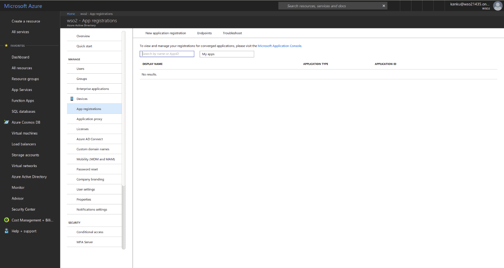
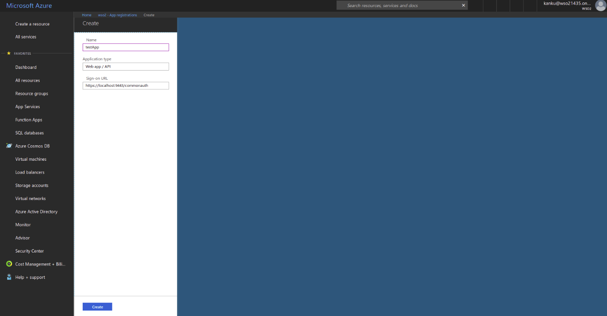
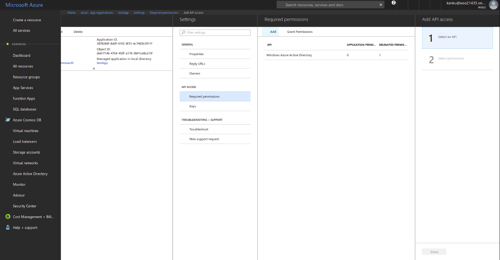
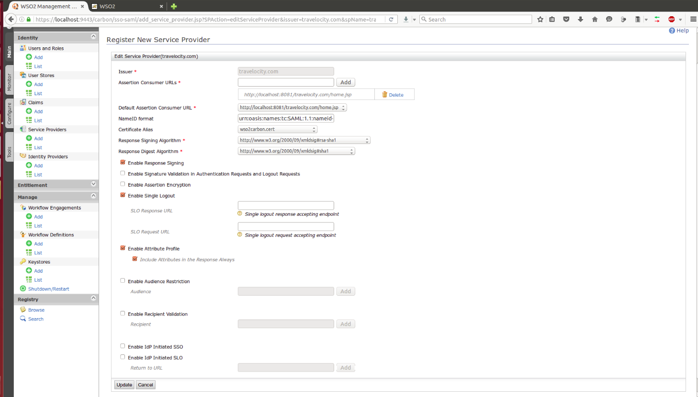
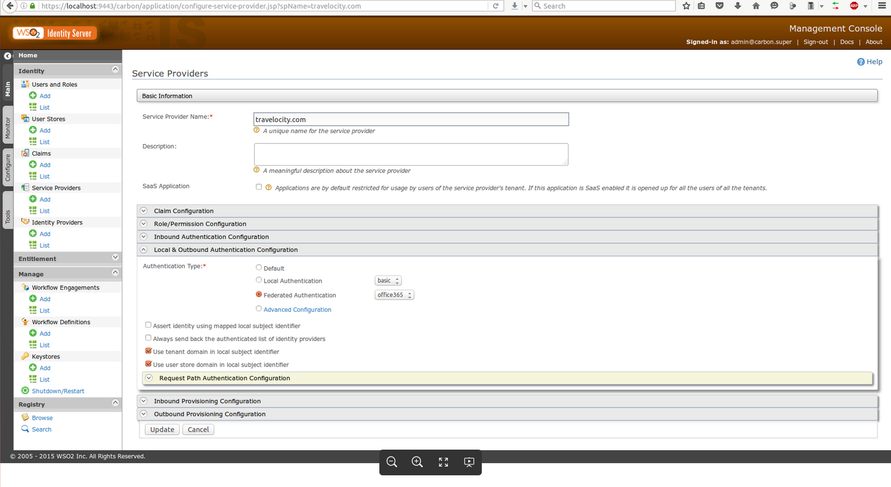
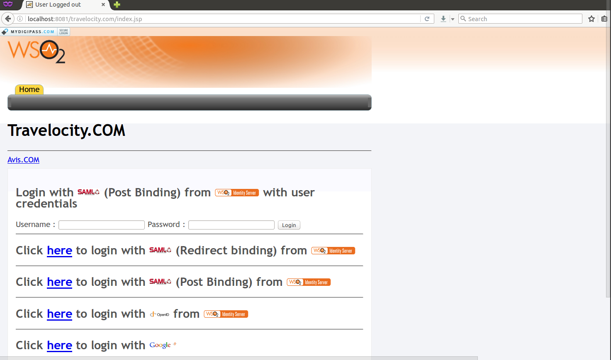

# Configuring the Microsoft Azure Active Directory Authenticator

To use the Microsoft Azure Active Directory (Microsoft Azure AD) authenticator with WSO2 Identity Server, first you need to configure  the authenticator with WSO2 Identity Server. The following topics provide instructions on how to configure the Microsoft Azure AD authenticator with WSO2 Identity Server using a sample app:
 ````
NOTE: The Microsoft Azure Active Directory Authenticator is tested with Office365 API version 2.0.
 ````
 
* [Deploying Office 365 artifacts](#deploying-office-365-artifacts)
* [Configuring the office 365 app](#configuring-the-office-365-app)
* [Deploying the travelocity.com sample app](#deploying-the-travelocitycom-sample-app)
* [Configuring the identity provider](#configuring-the-identity-provider)
* [Configuring the service provider](#configuring-the-service-provider)
* [Testing the sample](#testing-the-sample)

### Deploying office 365 artifacts
 * Download the org.wso2.carbon.extension.identity.authenticator.office365.connector-1.0.4.jar file from the [WSO2 store](https://store.wso2.com/store/assets/isconnector/list?q=%22_default%22%3A%22office365%22).
 * Add the org.wso2.carbon.extension.identity.authenticator.office365.connector-1.0.4.jar file to the <IS_HOME>/repository/components/dropins directory.

 >> NOTE :If you want to upgrade the Microsoft Azure AD Authenticator available with your existing WSO2 Identity Server product distribution, follow the provided [upgrade instructions](https://docs.wso2.com/display/ISCONNECTORS/Upgrading+an+Authenticator).

### Configuring the Office 365 app
 1. Go to [https://products.office.com/en-us/business/compare-office-365-for-business-plans](https://products.office.com/en-us/business/compare-office-365-for-business-plans), and create an Office365 account.
     
 2. Associate a Microsoft Azure AD subscription with the Office 365 account that you created.

    * If you have an existing Microsoft Azure AD subscription, log on to the [Microsoft Azure management portal](https://login.microsoftonline.com/common/oauth2/authorize?resource=https%3a%2f%2fmanagement.core.windows.net%2f&response_mode=form_post&response_type=code+id_token&scope=user_impersonation+openid&state=OpenIdConnect.AuthenticationProperties%3dKacUNidcHXlixnHEGpOm3zw3NCnurAxht3Y2rZa3Bg-LzJg6eC0mvtU3gTxOY4MzmZSX3nKUDRyk8LT6L86JUJfp038_1tlBTF-J0cL_yeo_ZOk0cgTfVKvxrL66-laSnHw4R_YXA0VaGe1HmHvvJ5blPCYwoY7xuoZWmn3bMTgMVOc4nxH-50KaxHyNFuypnUcDE-VIdKrS2niFDWDLaSPIbMM&nonce=636565268366247669.NTg2YWFmYjQtZTM2YS00NjcxLWIwNjAtNTUwMDRhNzU2NWNhYjUxZjBlNjEtN2RjYy00ODkyLWJlMzEtNWIxYTMyZjg0Njcy&client_id=c44b4083-3bb0-49c1-b47d-974e53cbdf3c&redirect_uri=https%3a%2f%2fportal.azure.com%2fsignin%2findex%2f&site_id=501430&client-request-id=c2349dd4-89d5-4c01-aa99-c91cb4d44c75&x-client-SKU=ID_NET&x-client-ver=1.0.40306.1554) with your existing office365 credentials to see the Microsoft Azure Dashboard.
Alternatively, you can create a new Azure AD subscription and associate it with your Office 365 account to register and manage apps. Follow the steps below to create a new Azure AD subscription:
       1. Go to [Azure.com](https://account.azure.com/signup?offer=MS-AZR-0044p&appId=docs) and sign up for a new account.
       2. Sign in using your Office 365 username and password. The account you use does not need to have administrator permission.
       3. Enter the required information and complete the sign-up process. To complete the sign-up process, you may have to enter payment information.
        >> NOTE : Although you need to provide your credit card details, you will not be charged as this is a free 30-day trial Azure subscription.

       
       * Now you have created a new Azure subscription and should be able to see the Microsoft Azure Dashboard.

 3. Register a new application in the Azure classic portal.
    * Select **Azure Active Directory** on the left panel, then select **App Registrations**, and finally select **New Application Registration**.

        
    * Create a new application and provide values for the following properties:
        **Name** : Name of the application.
        **Sign-on URL** :  https://localhost:9443/commonauth
    * specify **WEB APPLICATION AND/OR WEB API** as the **Application Type**.

        

    * Once the application is successfully added, you will see the registered app page of the application. On the registered app page, click **Settings** on the top menu, and copy the **Application ID**, which will be used as the **client id** of the registered app.

        

    * Click **keys** under **API ACCESS** to generate the client secret. Once you save the keys you will see the value of client secret.

        

    * Click **Required Permissions** under **API ACCESS**, click **Add**, then click **Select an API**, and then select **Office 365 Exchange Online**.

        

    * Once you select and add an API, click **Select permissions**, and then select **Delegated Permissions** to provide permission for **Office 365 Exchange Online**.

        

    * Click **Done**.

 You have now configured the office365 app.

### Deploying the [travelocity.com](https://www.travelocity.com/) sample app
    
You need to deploy the sample app in order to use the sample app in a sample scenario. For information on how to deploy the sample app, see [Deploying the sample app](https://docs.wso2.com/display/ISCONNECTORS/Deploying+the+Sample+App).

Once you deploy the sample app, the next step is to configure WSO2 Identity Server by adding a [service provider](https://docs.wso2.com/display/IS530/Adding+and+Configuring+a+Service+Provider) and an [identity provider](https://docs.wso2.com/display/IS530/Adding+and+Configuring+an+Identity+Provider).

### Configuring the identity provider
Follow the steps below to add and configure a [new identity provider](https://docs.wso2.com/display/IS530/Adding+and+Configuring+an+Identity+Provider) in WSO2 Identity Server:
 1. Download WSO2 Identity Server from [here](https://wso2.com/identity-and-access-management).
 2. Run [WSO2 Identity Server](https://docs.wso2.com/display/IS530/Running+the+Product).
 3. Log in to the [management console](https://docs.wso2.com/display/IS530/Getting+Started+with+the+Management+Console) as an administrator.
 4. Click the **Main** tab on the management console, go to **Identity** -> **Identity Providers**, and then click **Add**. 
 5. Specify an appropriate name as the **Identity Provider Name**. For more information on the identity provider configuration, see [Adding an identity provider](https://docs.wso2.com/display/IS530/Adding+and+Configuring+an+Identity+Provider#ConfiguringanIdentityProvider-Addinganidentityprovider).

    
 6. Expand the **Federated Authenticators** section, and then expand the **Office365 Configuration** section.
 7. Select **Enable** to enable the Microsoft Azure AD authenticator for theidentity provider.
 8. Select **Default** to make the Microsoft Azure AD authenticator the default authenticator for the identity provider.
 9. Specify appropriate values for the following fields:
    * **Client Id:** The client Id of your app.
    * **Client Secret:**  The client Secret of your app.
    * **Callback Url:** The service provider URL where code should be sent (https://localhost:9443/commonauth).
 10. Click **Register**.

Now you have configured the identity provider. Next, you need to configure the service provider.

### Configuring the service provider
Follow the steps below to configure the service provider:
 1. Click the **Main** tab on the management console, go to **Identity** -> **Service Providers**, and then click **Add**.
 2. Since you are using travelocity as the sample, enter [travelocity.com](https://www.travelocity.com/) as the **Service Provider Name** and click **Register**.
 3. Expand the **Inbound Authentication Configuration** section, then expand the **SAML2 Web SSO Configuration** section, and then click **Configure**.
 4. On the **Register New Service Provider** screen, specify travelocity.com as the **Issuer**, and add http://localhost:8080/travelocity.com/home.jsp as the **Assertion Consumer URL**.
 5. Select the following check boxes:
    * **Enable Response Signing**.
    * **Enable Single Logout**.
    * **Enable Attribute Profile**.
    * **Include Attributes in the Response Always**.

        
 6. Click **Update** to save the changes. You will be redirected to the **Service Providers** page.
 7. Expand the **Local and Outbound Authentication Configuration** section.
 8. Select **Federated Authentication**, and then select the identity provider that you created from the **Federated Authentication** list.

    

 9. Click **Update** to save the changes.

Now you have added and configured the service provider.

### Testing the sample
 
 1. To test the sample, go to http://<TOMCAT_HOST>:<TOMCAT_PORT>/travelocity.com/index.jsp. For example, http://localhost:8080/travelocity.com
 2. Log in using SAML via WSO2 Identity Server.

    
 3. Enter your Office365 credentials and sign in to Microsoft.

    
 4. Once you successfully log in, you will be redirected to the home page of the [travelocity.com](https://www.travelocity.com/) app.

    
